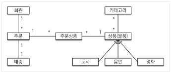
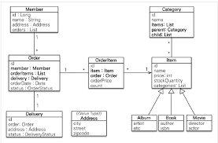

# 자바ORM표준 chapter 11

---
### 아래 내용들을 지켜서 개발해보자
- 한 클래스는 하나의 기능을 하게
- indent는 1을 넘어가지 말자
- TDD로 구현해보자 

---
### 도메인 설계 
1. 도메인 모델

2. 키 생성 전략
- Delivery : Sequence 전략으로 설정
- Order : Table 전략으로 설정
- OrderItem : 복합키로 설정(@Idclass)
- CategoryItem : 복합키로 설정(@EmbeddidId)
- 그외 : Identity전략으로 설정

3. 중복되는 값들은 값타입 객체로 추가하자
- City, Street, zipCode -> Address.class (@Embedded, @Embeddable)

4. @OneToMany의 컬렉션 연관관계는 일급컬렉션으로 감싸 처리하자 

5. 상속관계 매핑은 Join전략을 사용하자.

6. 모든 테이블에 속해야할 생성시간/수정시간 클래스는 분리하자 

---
### 비즈니스 로직 구현하기 
1. 회원기능
- 회원등록
  - 이미 존재하는 회원은 등록하면 안된다.
- 회원 목록 조회

2. 상품기능 
- 상품 등록
- 상품 목록 조회 
- 상품 수정 
  - 해당 상품의 재고를 수정할수 있어야 한다. 
    - 해당 상품의 재고를 증가시킬수 있어야 한다. 
    - 판매시, 해당 상품의 재고를 감소 시켜야한다. 
      - 만약 재고보다 더 많은 수 감소시 에러를 발생시켜야 한다. 

3. 주문기능 
- 상품 주문
  - 주문 내역 생성 및 상품 재고 감소시킨다. 
- 주문 내역 조회 
  - 전체 주문 가격또한 조회한다.
- 주문 검색
- 주문 취소 
  - 주문 상태를 취소로 변경한다. 
  - 만약 배송을 완료한 상품이면 주문 취소하지못하도록 예외가 발생한다. 

---
# branch : restful
### API 서버로 변경하자 
- restful하게 구현해보자
- Error는 code, message로 전달한다 
- ITEM 타입별로 분산된 URI를 합쳐보자 
- 모든 예외처리 전달은 advice를 통해서 구현한다